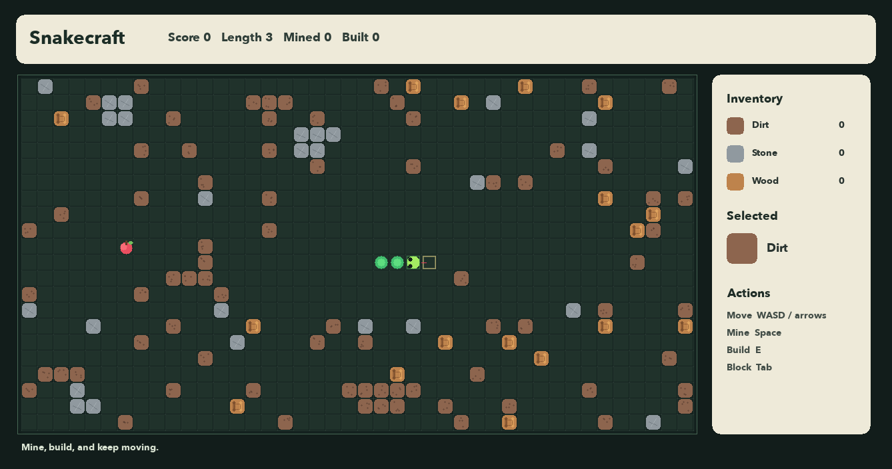

# Snakecraft C++

Snakecraft C++ starts as a classic Snake game and nudges it toward a tiny "Terraria clone" by adding a destructible world. Mine terrain, collect blocks, place them back into the map, and keep the snake alive while the board changes around you.



## Features

- SDL2 desktop app with a drawn snake, animated food, tile art, HUD, and overlays.
- Classic Snake movement, food, growth, scoring, and self-collision.
- Biome-aware procedural map with forest, cave, and desert regions.
- Five block types: dirt, stone, wood, sand, and high-value ore.
- Mining: break the block in front of the snake to collect resources.
- Building: place collected blocks back into the world.
- Inventory and selected block display in the HUD.
- Persistent top-five high score table.
- Save and load full runs to `~/.snakecraft/savegame.txt`.
- Wrap-around world mode (`T`) so edges become portals.
- Combo streak and golden food (`$`) for higher scores.
- Undo the last beat (`U`) — including a death tick.
- Pause, restart, and quit controls.
- Terminal fallback build for simple environments.
- CTest suite for core mechanics, biomes, save/load, and scoring.
- GitHub Actions CI on macOS and Ubuntu.

## Controls

| Key | Action |
| --- | --- |
| `W` / arrow up | Move up |
| `A` / arrow left | Move left |
| `S` / arrow down | Move down |
| `D` / arrow right | Move right |
| `Space` | Mine the block in front of the snake |
| `E` | Place the selected block in front of the snake |
| `Tab` | Cycle selected block type |
| `F5` / `5` | Save game (SDL / terminal) |
| `F9` / `9` | Load game (SDL / terminal) |
| `T` | Toggle wrap-around edges |
| `U` | Undo last move / mine / build |
| `P` | Pause |
| `R` | Restart |
| `Q` | Quit |

## Build and Run

### Desktop App

Install SDL2 and SDL2_ttf first:

```sh
brew install sdl2 sdl2_ttf
```

Then build and run the windowed app:

```sh
cmake -S . -B build
cmake --build build
open build/Snakecraft.app
```

You can also run the app binary directly:

```sh
./build/Snakecraft.app/Contents/MacOS/Snakecraft
```

### Terminal Version

```sh
cmake -S . -B build
cmake --build build
./build/snakecraft
```

## Run Tests

```sh
cmake -S . -B build
cmake --build build
ctest --test-dir build --output-on-failure
```

## Gameplay Notes

The map is not just a background. Dirt, stone, and wood block your path, so mining can save you from a collision. Building lets you reshape future routes, trap yourself by accident, or create narrow tunnels once you have enough resources.

Food appears only in open spaces. Eating food grows the snake and increases your score. Mining and building also add small score bonuses, so careful terrain work matters.

## Project Layout

```text
snakecraft-cpp/
  CMakeLists.txt
  src/
    Game.hpp
    Game.cpp
    Terminal.hpp
    SdlApp.cpp
    main.cpp
  tests/
    test_game.cpp
```

## Persistence

High scores and save files are stored locally:

```text
~/.snakecraft/highscores.txt
~/.snakecraft/savegame.txt
```

## Future Ideas

- Add crafted tools and crafting recipes.
- Add enemies that tunnel through terrain.
- Add lighting, caves, and day/night events.
- Add multiplayer spectate mode.
